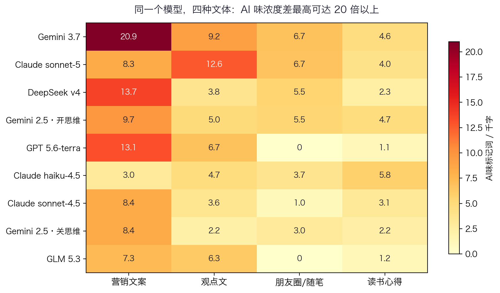

# evidence-based-humanizer

**中文 | [English](#english)**

一套**有证据出处**的中英文"去 AI 味"（de-AI-flavor）流水线与配套研究。

市面上绝大多数 humanizer 是一张词表 + 一句 prompt。本仓库的不同之处在于：**每条规则都标注出处**——或来自公开研究（Kobak 等《科学·进展》的 delve 词频研究、Stanford Patterns 检测器误伤研究、Anthropic 思维链忠实性研究等），或来自我们自己的一项对照实验：**9 个模型档位 × 4 种文体 × 3 次 = 108 篇中文短文的 AI 味量化**（含同一模型开/关思维链的对照）。

> 核心立场：目标是"中文读者读起来像人写的"，**不是**骗过朱雀/知网/GPTZero。检测分不是质量指标。

## 仓库结构

```
├── humanizer-zh/          中文去 AI 味 skill（SKILL.md + 5 个 assets：词表/句式/语体/泄露正则/质检）
├── humanizer-en/          英文去 AI 味 skill（SKILL.md + 4 个 assets）
├── experiment/            108 篇对照实验：脚本（可复跑）+ 统计 + 全部数据
├── figures/               文章与 README 配图（SVG 矢量 + PNG）
├── examples/              引用纪律与 prior art 定位（哪些观点是谁先提出的）
└── assets 摘要            见下"证据卡片"
```

## 五阶段流水线（humanizer-zh）

```
Stage 1 诊断 → Stage 2 减法 → Stage 3 改写 → Stage 4 泄露清洗 → Stage 5 终检
     ↑                                                          │
     └──────────────── 未达标则回到 Stage 1 ────────────────────┘
```

| 阶段 | 做什么 | 关键约束 |
|---|---|---|
| 1 诊断 | 语境门控（商务/默认/营销/学术），五类味型打每千字分表 | 先判语境再打分：公文黑话在默认输出中为 0 |
| 2 减法 | 删衔接套话、开场套话、强行升华 | 只删无信息量的字；信息密度不降 |
| 3 改写 | 按主导味型对症改写（抒情腔→具体细节等） | 不新造细节：具体性靠追问，不靠编造 |
| 4 泄露清洗 | 思考腔残留、界面残留、agent 叙事、自用图表 | 第三代 AI 味是现有工具最不覆盖的盲区 |
| 5 终检 | 事实/数字/引语零改动 diff，重跑诊断对比 | 附检测器免责声明 |

默认循环 2 轮、最多 3 轮：**改写动作本身会引入新味**。

## 证据卡片（来自 108 篇实验）

| 发现 | 数字 | 出处 |
|---|---|---|
| 思维开关对照：开思维的成稿 AI 味更浓 | 标记词 +57%（6.21 vs 3.96/千字） | `experiment/findings.md` |
| 公文黑话是语境产物，不是默认味 | "赋能/抓手/闭环"在 108 篇默认输出中 **0 次** | 同上·发现 D |
| 默认输出真正的主味 | 抒情腔 + "值得注意的是"式衔接套话 | 同上·发现 D |
| 各厂牌有"口音" | Gemini 3.7 抒情腔独占 6.9；DeepSeek"不是…而是"2.05；GLM 排比三连 3.85 | 同上·发现 E |
| 新模型更有味 | Gemini 2.5→3.7 涨 67%；Claude sonnet 4.5→5 近翻倍 | 同上·发现 B |
| 语体错位是主罪 | 同一模型跨文体差 3–20 倍（gemini-3.7 营销文案 20.87 vs 朋友圈 0） | 同上·发现 C |



## 外部研究的锚点数字

- delve 使用率超基线 **28 倍**（1500 万篇 PubMed 摘要）— Kobak 等，*Science Advances*
- LLM 润色使写作复杂度**方差下降 21–50%** — McDaniel 等，arXiv:2502.11266
- 检测器把 **61%+** 非母语作文误判为 AI — Stanford，*Patterns* 2023
- 人类识别 AI 文本平均准确率 **87.6%**（16 数据集、9 语言）— Wang 等，ACL
- 思维链常不忠实：Claude 3.7 仅 **25%** 在思考中提及提示词（R1 为 39%）— Anthropic 2025-04

完整署名与 prior art 定位见 [`examples/related-work.md`](examples/related-work.md)。

## 使用

把 `humanizer-zh/`（或 `humanizer-en/`）目录放进你的 agent 技能目录（如 Claude Code 的 `.claude/skills/`、Codex 的 `.codex/skills/`），然后对被标为"AI 味重/没有人味"的中文交付文本触发即可。也可直接把 `SKILL.md` 的规则当作人工审校清单使用。

复现实验：

```bash
cd experiment
python3 run_experiment.py   # 断点续跑；模型 ID 是 2026-08 快照，复跑前查 OpenRouter 最新 ID
python3 analyze.py
```

## 局限性（引用本仓库数据时请带上）

- 每格样本 n=3，无显著性检验，只做方向性参考
- 仅测 flash/轻量档，不代表各厂旗舰
- 词表与句式清单来自社区整理，非学术标准
- 统计的是表层标记词，不等于读者实际闻到的"味"

## License

MIT
